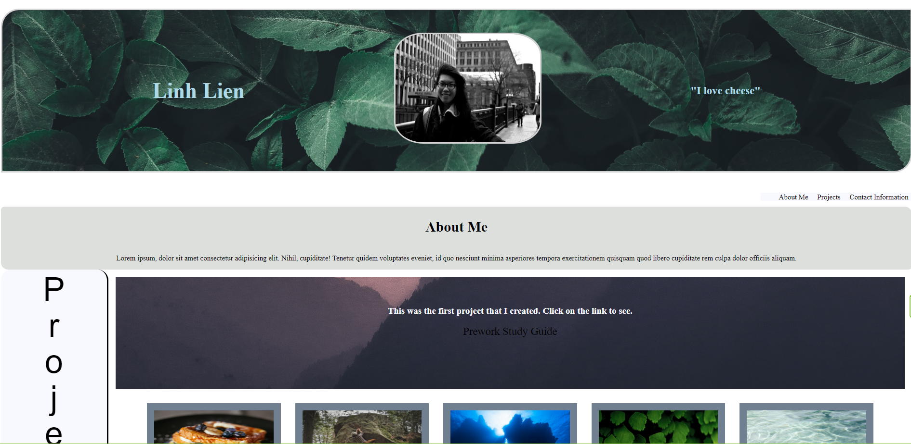
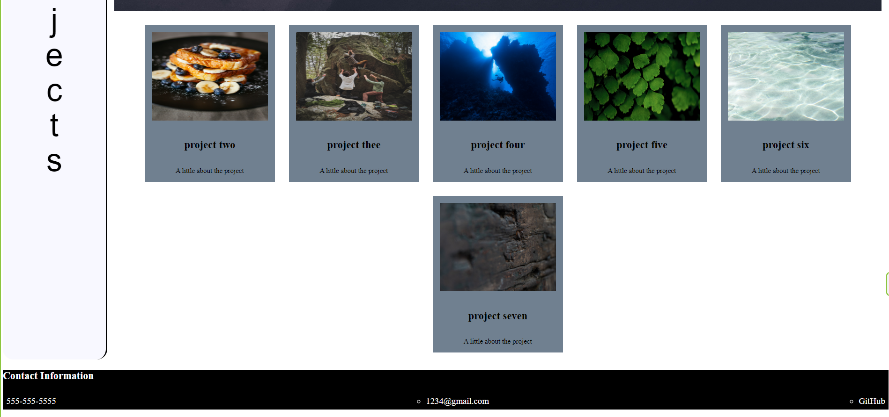

# Portfolio

## Description
 This portfolio is to showcase projects that will be built thought this bootcamp course. With each week, there will be different projects to showcase the knowledge that was leared thoughout that week. Below is the link to this portfolio. 

 Link: https://liex149.github.io/Portfolio/ 

## Installation

N/A

## Usage
As users navigate through the portfolio they can click on each link (about me, projects, and contact information), which will then navigate to each section. The first link navigates to the first project (prework) for the class. As the class continues more projects will be added onto the portfolio to showcase future employers. Below is a sample of the portfolio webpage. 

## Credits

N/A

## License

N/A

## Badges

N/A

## Features

N/A

## How to Contribute

N/A

## Tests

N/A